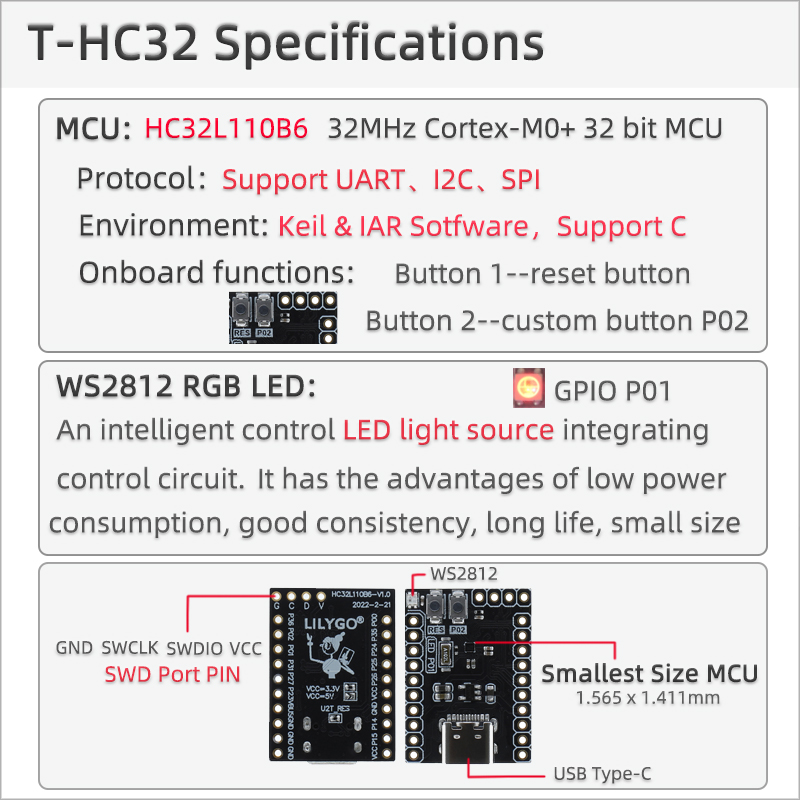
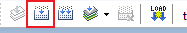
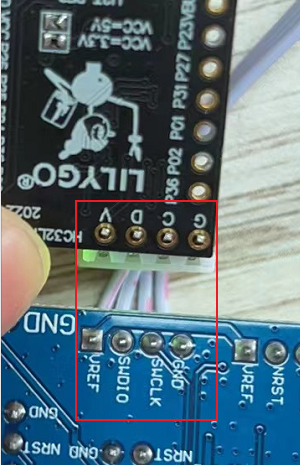

<h1 align = "center"> 🌟LilyGO T-HC32🌟</h1>

# Quick Start
##  Build the project (Windows)
1. Support the use of MDK and IAR development environment (this article uses MDK by default)
2. Open the factory project\examples\factory\MDK in the examples folder
3. Copy the downloaded algorithm in the `\tools\Download` algorithm folder to the `~\Keil5\ARM\Flash` directory
4. Click the Build button to see the `.hex` binary file generated in the `factory\MDK\output\release` directory

## upload files
1. Using JLINK
  - Configure Debug
 
  - Select Jlink debugger
  
  - Select download algorithm
  
  - Connect JLINK with T-HC32
  
  - Check if it has been successfully identified
  
  - Click the upload button to start the upload process
  

2. Using U2T
  - Open HDSC.exe in T-HC32\tools\HDSC ISP directory. Select the HEX file generated by the build.
   
  - Use the shortest possible USB cable to serially connect the U2T and select the corresponding port.
  Click Execute at the moment (simultaneously) after clicking the RES release. Only 100mm of time is left for synchronization after RES is pressed and released.